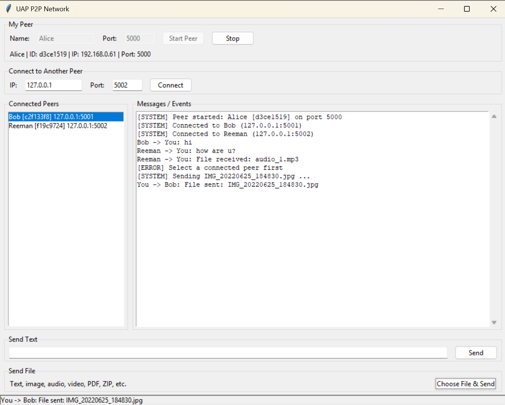
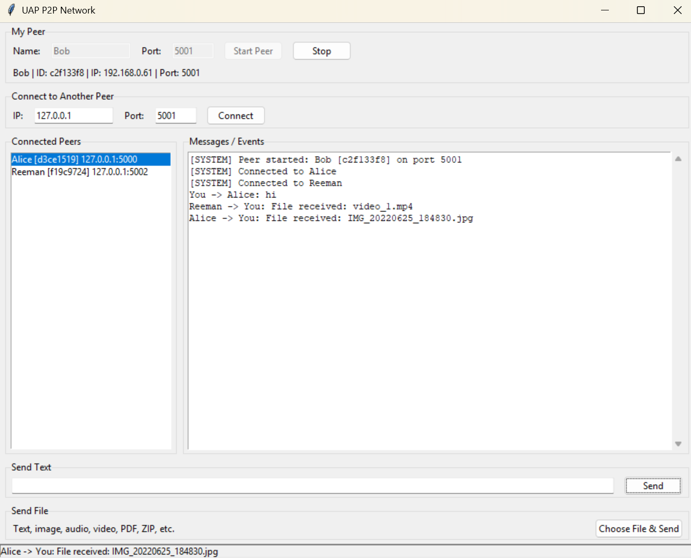
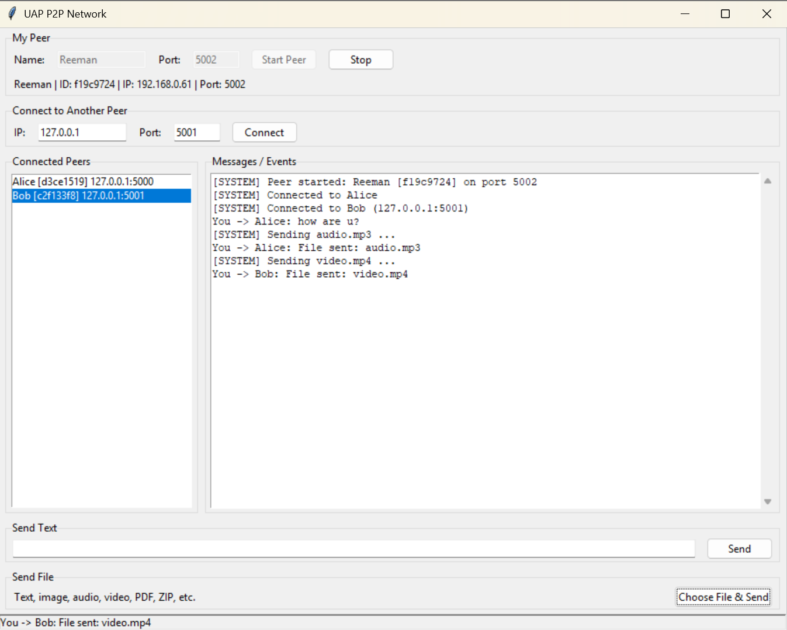
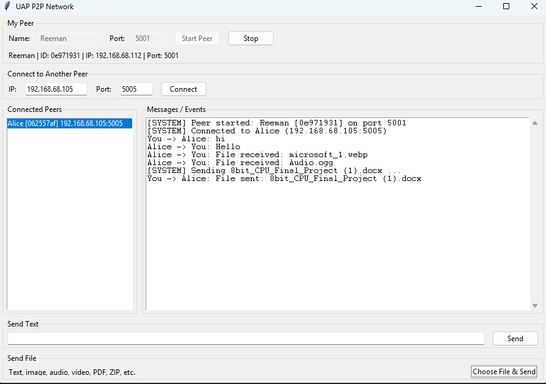
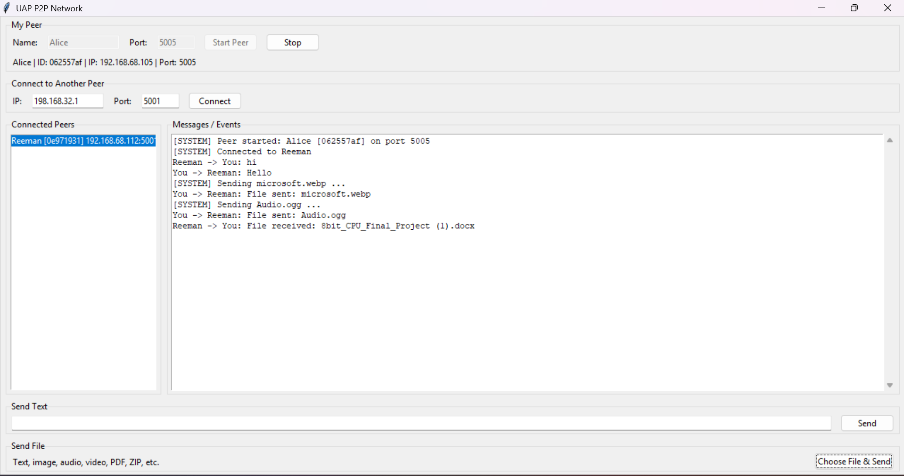

# P2P Network - Communication and File Sharing

**Course:** CSE 433 - Blockchain & Distributed Security Lab, University of Asia Pacific<br>
**Student:** Md Sahriar Asif - 22201111 - Section: AB2<br>
**Instructor:** Nahida Marzan - Lecturer - CSE, UAP<br>

## Project Description

A lightweight peer-to-peer application written in Python using TCP sockets.
Every running instance is one *peer*, and every peer is both a **TCP server**
(accepts incoming connections) and a **TCP client** (connects to other peers).
There is no central server. Connected peers can exchange text messages and
files (text, image, audio, video, PDF, ZIP, ...) directly.

### How it works

* **Handshake:** the connecting peer sends `hello`; the other peer replies `hello_ack`.
  Both sides now know each other's name, id and listening port.
* **Framing:** every message is `[4-byte length][JSON payload]`; the receiver reads
  the length first and then exactly that many bytes.
* **Message types:** `hello`, `hello_ack`, `text`, `file`
  (plus a small `error` message used only to refuse a connection, e.g. connecting to yourself).
* **File transfer:** a `file` message carries `filename` and `filesize`, followed by the
  raw bytes of the file sent in 64 KB chunks. The receiver reads exactly `filesize`
  bytes and writes them to `downloads/`. Files are treated as plain binary data,
  so one code path handles every file type.
* **Threads:** one thread accepts connections; each connection has its own receive thread.

### Files

| File | Responsibility |
|------|----------------|
| `main.py` | Tkinter GUI |
| `p2p_node.py` | Networking: server, client, connections, text, file transfer |
| `protocol.py` | Message framing and message builders |
| `downloads/` | Received files are stored here |

## Requirements

* Python 3.9 or later (Windows, Linux or macOS)
* Tkinter (included with the standard Python installer; on Ubuntu/Debian: `sudo apt install python3-tk`)
* No third-party packages (`requirements.txt` is intentionally empty)

## Installation / Setup

No installation is needed. Unzip the project and open a terminal in the project folder.

## How to Run

```
python main.py
```

(use `python3 main.py` on Linux/macOS). Run it once per peer, e.g. in three terminals.

## How to Connect Two Peers

1. **Peer A:** enter a name and a port (e.g. `Alice`, `5000`) and click **Start Peer**.
2. **Peer B:** enter a different name and port (e.g. `Bob`, `5001`) and click **Start Peer**.
   (Peers on the same computer must use different ports.)
3. On **Peer B**, under *Connect to Another Peer* enter A's IP and port
   (`127.0.0.1` / `5000` on the same computer, or A's LAN IP such as `192.168.1.10` / `5000`)
   and click **Connect**.
4. Both peers now show each other in the *Connected Peers* list.
5. For a third peer, start Peer C on another port and connect it to **each** peer
   you want to talk to (C -> A and C -> B).

The IP address of a peer is shown under its Start button once it is running.
For different computers they must be on the same LAN/Wi-Fi and the firewall must
allow the chosen port.

## How to Send Text

Select a peer in the *Connected Peers* list, type in the *Send Text* box and press
**Send** (or Enter). It appears as `Alice -> You: ...` on the receiver.

## How to Transfer Files

Select a peer in the list, click **Choose File & Send**, and pick any file.
The receiver sees `File received: name` in the log and finds the file in the
`downloads/` folder. An existing file is never overwritten (a `_1`, `_2`, ... suffix is added).

## Error Handling

Invalid IP, invalid port, connection refused, peer not running, timeouts, peer
disconnecting (also in the middle of a transfer), nonexistent file, invalid file size,
and sending without selecting a peer all produce a message in the log, e.g.
`[ERROR] Connection failed: [Errno 111] Connection refused`. The application does not crash.

## Example Screenshots





## Example Screenshots (two-computer test)



